# ⚓ Industrial-ERP-System

[](https://opensource.org/licenses/MIT)
[](https://dotnet.microsoft.com/download/dotnet/8.0)
[](https://reactjs.org/)
[](https://www.docker.com/)

**Industrial-ERP-System**, endüstriyel üretim ve stok yönetimi süreçlerini dijitalleştirmek amacıyla geliştirilmiş, Full-Stack bir kurumsal kaynak planlama (ERP) çözümüdür. Özellikle **IntekMarin** operasyonları için özelleştirilmiş, dokunmatik terminallerle tam uyumlu bir kullanıcı deneyimi sunar.

---
> ⚠️ **VERİ GİZLİLİĞİ VE GÜVENLİK NOTU**
> Bu vitrin reposunda ve sistem ekran görüntülerinde yer alan tüm ürünler, stok miktarları, müşteri cari bilgileri ve finansal değerler, sistemin yeteneklerini sergilemek amacıyla yerel ortamda (localhost) rastgele oluşturulmuş **test (mock/dummy) verileridir**. Sistemde yer alan hiçbir bilgi, Intek Marin firmasının gerçek ticari faaliyetlerini, envanterini veya gizli finansal verilerini **yansıtmamaktadır.**


## 🏗️ Sistem Mimarisi

Proje, modern yazılım prensipleri ve DevOps pratikleri üzerine inşa edilmiştir:

*   **Frontend:** React ve Tailwind CSS kullanılarak geliştirilen, responsive ve performans odaklı arayüz.
*   **Backend:** .NET 8 Web API ile geliştirilmiş, SOLID prensiplerine uygun katmanlı mimari.
*   **Database:** İlişkisel veri modeli için MSSQL Server.
*   **DevOps:** Tüm servisler Dockerize edilmiş; Nginx Proxy Manager ve SSL (Let's Encrypt) ile güvenli bir VPS üzerinde yayına alınmıştır.

---

## 🔥 Temel Özellikler

*   **🔒 Gelişmiş Kimlik Doğrulama:** JWT (JSON Web Token) tabanlı güvenli oturum yönetimi ve rol tabanlı yetkilendirme sistemi.
*   **📦 Stok Yönetimi:** Gerçek zamanlı stok takibi, kritik eşik uyarıları ve dinamik ürün yönetimi.
*   **📲 WhatsApp Entegrasyonu:** Kritik stok seviyelerine ulaşıldığında, WhatsApp üzerinden otomatik bildirim gönderen akıllı uyarı sistemi.
*   **🛠️ Dockerize Altyapı:** Tek komutla (`docker-compose up`) tüm veritabanı ve servislerin ayağa kalkmasını sağlayan konteyner mimarisi.
*   **🌐 Canlı Panel:** Nginx yapılandırması sayesinde SSL sertifikalı güvenli domain yönetimi.

---

## 📸 Sistem Ekranları (UI Showcase)

### 🔐 Login ve Erişim
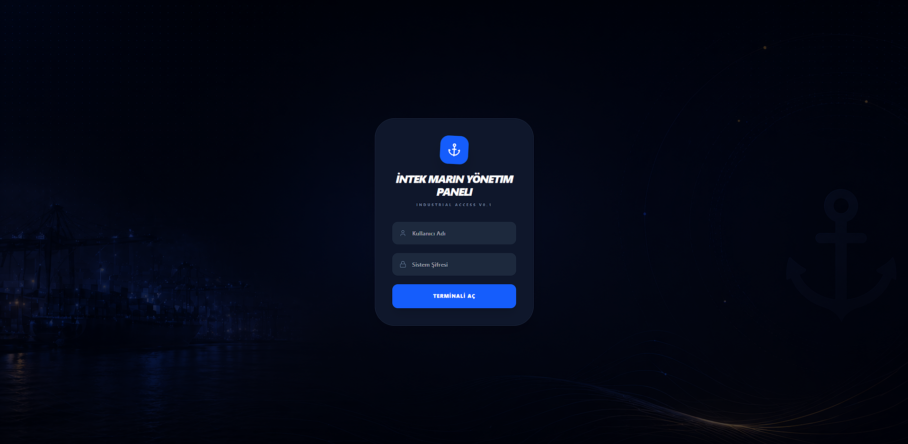

### 📊 Dashboard ve Raporlama Merkezi
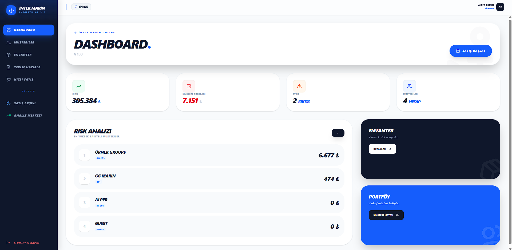
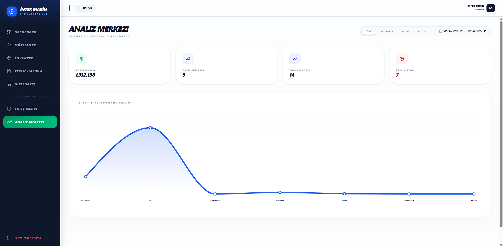

### 📦 Envanter ve Stok Yönetimi
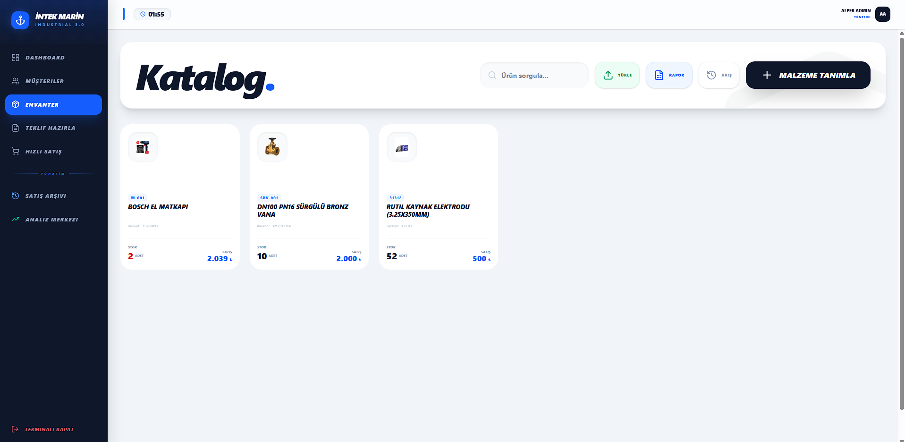
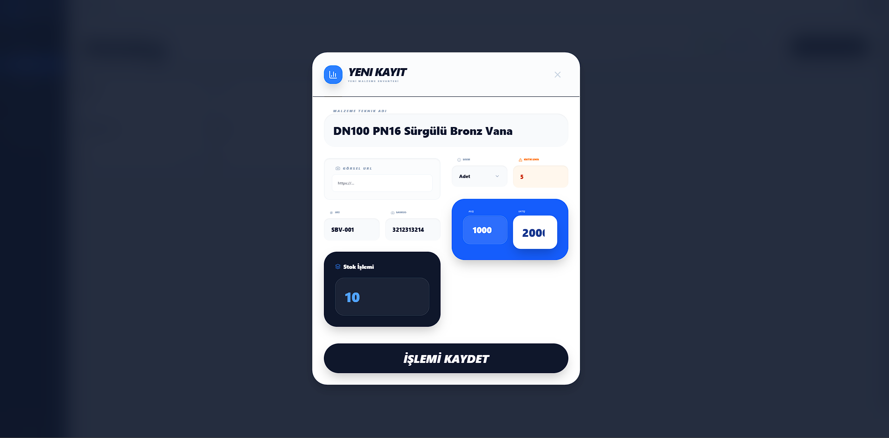

### 💳 Müşteri (Cari) Takip Sistemi
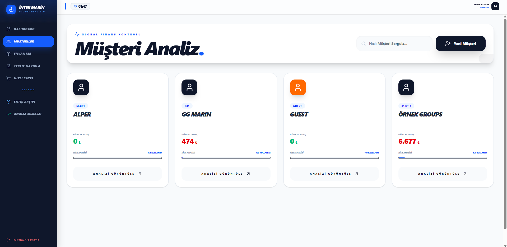
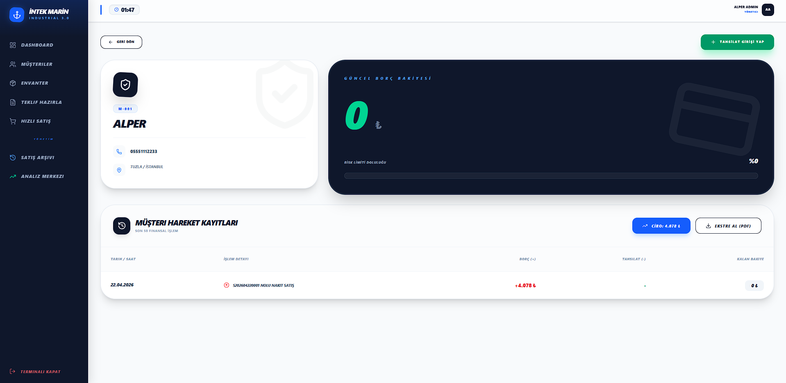
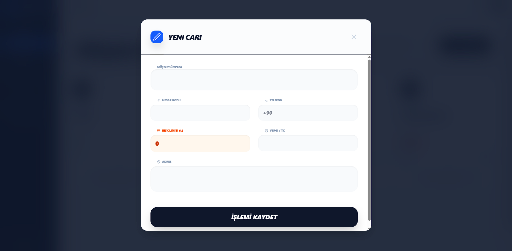

### 🛒 Satış ve Teklif İşlemleri
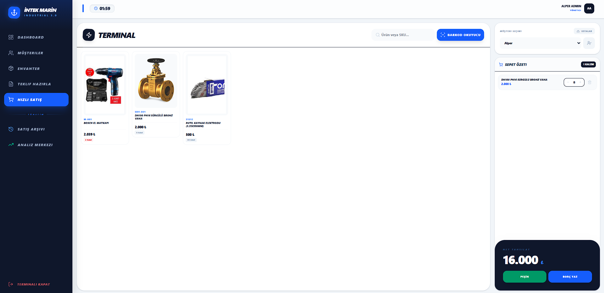
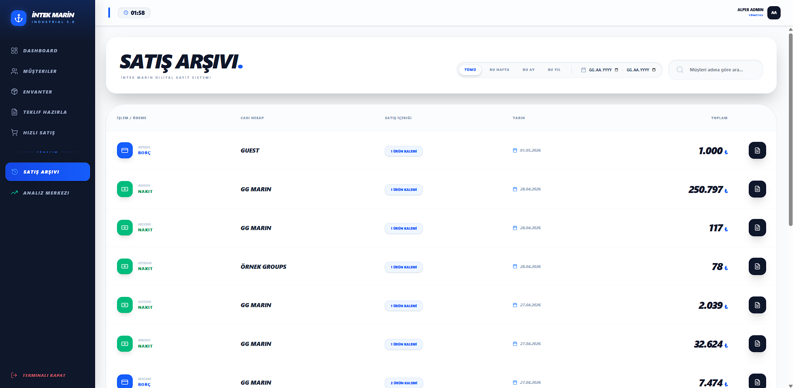
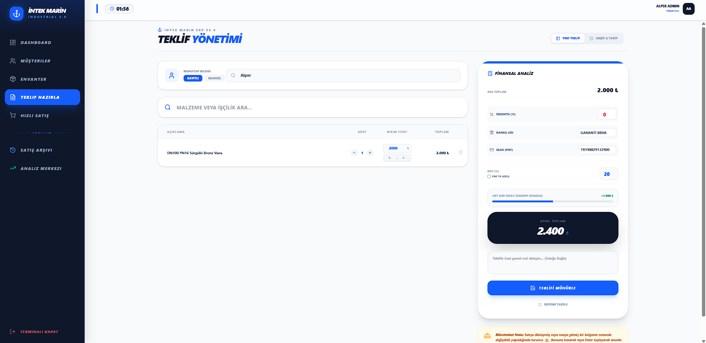
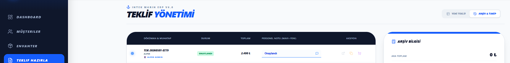
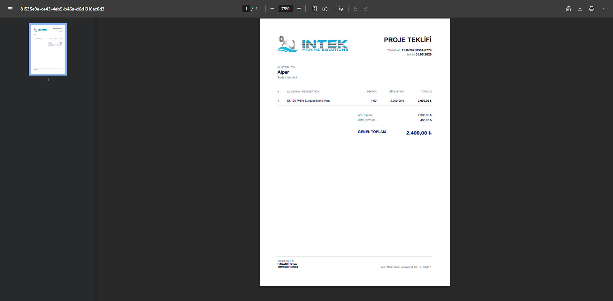

### 🖨️ Barkod Sistemi & 📲 WhatsApp Uyarıları
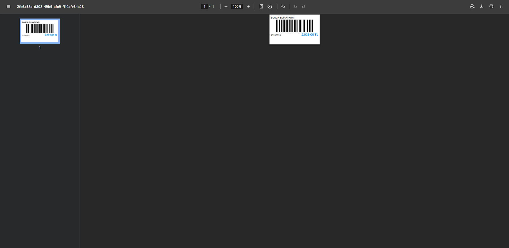
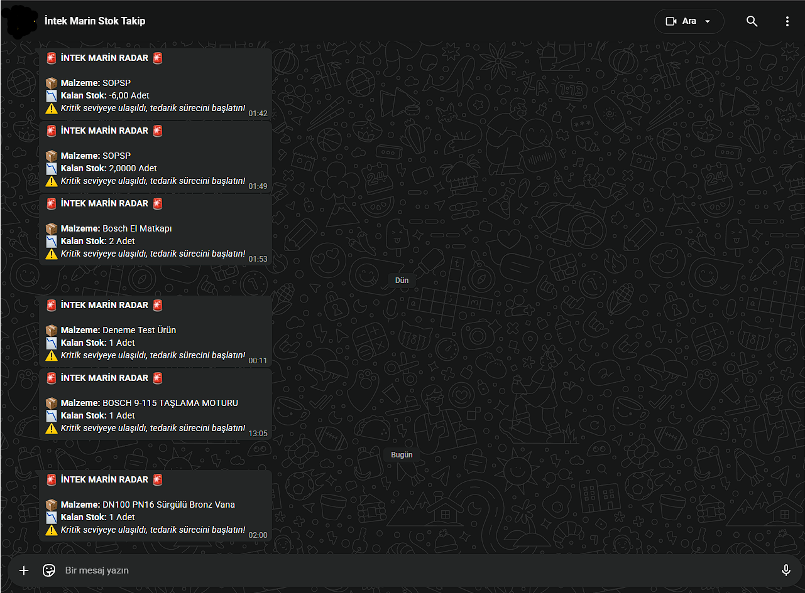

---

## 🛠️ Teknoloji Yığını (Stack)

### Backend
- C# / .NET 8.0 Web API
- Entity Framework Core
- JWT Authentication
- WhatsApp API Integration (CallMeBot)

### Frontend
- React 18 & Vite
- Tailwind CSS (Modern UI)
- Axios (API Management)

### Infrastructure / DevOps
- Docker & Docker Compose
- MSSQL Server
- Nginx Proxy Manager (NPM)
- Let's Encrypt SSL

---

## 🚀 Kurulum ve Çalıştırma

Projenin yerel ortamda veya sunucuda çalıştırılması için Docker kurulu olması yeterlidir:

1.  Repoyu klonlayın.
2.  Gerekli şifre yapılandırmalarını `appsettings.json` ve `.env` dosyalarında yapın.
3.  Terminalde projenin ana dizinine gidin:
```bash
docker-compose up -d --build


👨‍💻 Geliştirici
İsim: Alper

Pozisyon: Computer Programming Student (Senior)

Mezuniyet: Haziran 2026

İlgi Alanları: Database Engineering, Software Architecture, DevOps

© 2026 Industrial-ERP-System. Tüm Hakları Saklıdır.
